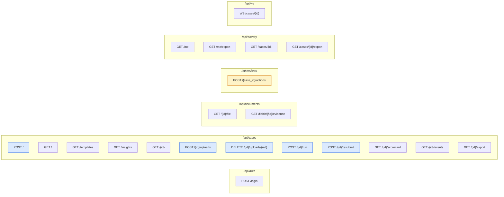

# API Documentation

**Base URL:** all endpoints are served under `/api` on the same origin as the SPA. **Interactive
docs:** FastAPI auto-generates OpenAPI/Swagger at **`/docs`** and ReDoc at **`/redoc`** (title
`VITA API`, version `0.1.0` — `main.py`).

**Auth:** every endpoint except `POST /api/auth/login` and `GET /health` requires an
`Authorization: Bearer <JWT>` header (`Depends(current_user)`). See
[Security.md](../security/Security.md).

**Versioning:** **[NOT PRESENT]** — there is no URL/media-type version segment. The path prefix
is `/api` (unversioned). Version-in-path is a future consideration.

## Conventions

- Request/response bodies are JSON unless noted (uploads are `multipart/form-data`; exports and
  file endpoints return binary).
- Timestamps are ISO-8601 strings from **IST wall-clock** values.
- Standard errors: `401` invalid/missing token, `403` role not permitted, `404` not found,
  `409` state conflict, `422` validation error, `400` bad parameter. Error body: `{"detail": "..."}`.

## Endpoint map



Legend: blue = uploader/admin only · amber = reviewer/admin only · others = any authenticated user.

---

## Authentication

### `POST /api/auth/login`
Authenticate and receive a JWT.

**Body:** `{ "email": "uploader@cleardesk.dev", "password": "demo1234" }`
**200:** `{ "access_token": "<jwt>", "role": "uploader", "full_name": "..." }`
**401:** invalid credentials.
Side effect: writes an `AUTH / LOGIN` activity log.

---

## Cases

### `POST /api/cases` — create case  _(uploader/admin)_
**Body:** `{ "process": "CAR_LOAN" }` (optional; a template code). If provided the template is
locked (`inference_confidence=100`) so agents verify against it instead of re-inferring.
**200:** `{ "id": "<uuid>", "status": "UPLOADED" }` · **403** if not uploader/admin.

### `GET /api/cases` — list cases (paginated)
**Query:** `status`, `q` (name/ref search), `created_by`, `updated_by`, `page=1`,
`page_size=10`, `sort` (`name|status|created_at|updated_at|created_by|updated_by`),
`order` (`asc|desc`).
**200:**
```json
{ "items": [ { "id","ref_no","name","status","created_by","updated_by","created_at","updated_at" } ],
  "total": 42,
  "stats": { "total": 42, "in_review": 7, "approved": 30, "rejected": 5 } }
```

### `GET /api/cases/templates` — bank-service templates + checklists
**200:** array of `{ code, name, description, mandatory, optional, docs:[{code,name,mandatory}] }`.

### `GET /api/cases/insights?status=IN_REVIEW|APPROVED|REJECTED` — SLA analytics
Computed on-read against a 24h SLA (`SLA_HOURS=24`).
**200:** `{ status, sla_hours, total, on_time, overdue, pivot:[{process,on_time,overdue}],
cases:[{id,ref_no,name,process,created_at,actioned_at,overdue}] }` · **400** for other statuses.

### `GET /api/cases/{id}` — case detail
Full aggregate: status, inferred process, checklist + completeness, uploads, run history (with
field diffs), documents (latest-round fields), discrepancies. **404** if unknown.

### `POST /api/cases/{id}/uploads` — upload files  _(uploader/admin)_
**Body:** `multipart/form-data` `files[]`. Saves under `uploads/{case_id}/`.
**200:** `{ "saved": ["pan.png", ...] }`. Writes a `DOCUMENT / FILES_UPLOADED` log.

### `DELETE /api/cases/{id}/uploads/{upload_id}` — remove a file  _(uploader/admin)_
**200:** `{ "ok": true }` · **409** if case is `PROCESSING` · **404** if upload not found.

### `POST /api/cases/{id}/run` — start verification  _(uploader/admin)_
Sets status `PROCESSING`, creates `CaseRun(run_no=1, INITIAL)`, enqueues `run_pipeline` as a
**background task**, returns immediately.
**200:** `{ "status": "PROCESSING" }`. Progress streams over the WebSocket.

### `POST /api/cases/{id}/resubmit` — edit-and-retry  _(uploader/admin)_
**Body:** `{ "note": "re-uploaded clearer PAN" }` (optional). Snapshots current fields, deletes
prior *analysis* (documents/fields/discrepancies — audit rows kept), re-runs agents, records the
diff.
**200:** `{ "status": "PROCESSING", "run_no": 2 }` · **409** if already processing.

### `GET /api/cases/{id}/scorecard` — latest scorecard
**200:** `{ version, overall_score, completeness_score, checklist, doc_scores, summary,
auto_verified, review_needed, hard_fail }` · **404** if none yet. Older scorecards without a
completeness value get it computed live.

### `GET /api/cases/{id}/events?after=<id>` — agent event history
**200:** array of `{ id, agent, type, payload, at }` (up to 200, id-ordered, `id > after`). Used
by the SPA to backfill before the WebSocket takes over.

### `GET /api/cases/{id}/export?format=xlsx|pdf` — export scorecard
**200:** binary file, `Content-Disposition: attachment; filename="<base>_ddmmyyyyhhmmss.<ext>"`
(IST). **400** for other formats. Writes an `EXPORT` log.

---

## Documents

### `GET /api/documents/{document_id}/file`
Returns the original uploaded file (`FileResponse`). **404** if unknown.

### `GET /api/documents/fields/{field_id}/evidence`
Returns the cropped evidence image for one extracted field. **404** if no crop.

---

## Reviews

### `POST /api/reviews/{case_id}/actions` — record a review decision  _(reviewer/admin)_
**Body:**
```json
{ "action": "ACCEPT|CORRECT|REJECT_DOC|REQUEST_REUPLOAD|APPROVE_CASE|REJECT_CASE",
  "discrepancy_id": "<uuid?>", "corrected_value": "<str?>", "note": "<str?>" }
```
Behaviour: `ACCEPT`→`HUMAN_ACCEPTED`; `CORRECT`→`HUMAN_CORRECTED` + creates a `FeedbackExample`;
`APPROVE_CASE|REJECT_CASE|REQUEST_REUPLOAD`→ case status change. `ACCEPT`/`CORRECT` trigger a new
scorecard version.
**200:** `{ "ok": true, "case_status": "APPROVED" }` · **403** if not reviewer/admin.

---

## Activity logs

### `GET /api/activity/me` — my activity (paginated)
**Query:** `page`, `page_size`, `sort` (`when|category|action|details|user|case`), `order`,
`category`, `action`, `q`. **200:** `{ items:[{id,when,category,action,details,user,case,case_id}], total }`.

### `GET /api/activity/me/export?format=xlsx|pdf` — export my activity (≤2000 rows).

### `GET /api/activity/cases/{case_id}` — case activity (paginated) — same shape as `/me`.

### `GET /api/activity/cases/{case_id}/export?format=xlsx|pdf` — export case activity.

---

## WebSocket

### `WS /api/ws/cases/{case_id}` — live agent feed
Client connects after starting a run; server pushes each `agent_event` as JSON
`{ id, agent, type, payload, at }` as the agents converse. Client sends `"ping"` every 20s as
keepalive. No auth handshake on the socket itself **[observation]** — the case id is the scope;
event contents are non-sensitive conversation text. (See Security notes.)

---

## Health

### `GET /health`
**200:** `{ "status": "ok" }`. Not under `/api`; used by Render's health check.

---

## Catch-all (SPA)

`GET /{full_path}` (only when a built `./static` exists) serves static assets or falls back to
`index.html` for client-side routes. Excluded from the OpenAPI schema.
