# VITA — Architecture

This document is the authoritative architecture description for VITA, reverse-engineered from
the source. Diagrams are Mermaid (render in GitHub/most Markdown viewers). Inferred or assumed
elements are marked **[INFERRED]** / **[ASSUMPTION]**; absent-but-commonly-expected elements are
marked **[NOT PRESENT]**.

## Contents

1. [Architecture style & rationale](#1-architecture-style--rationale)
2. [High-level system architecture](#2-high-level-system-architecture)
3. [C4 Model](#3-c4-model)
4. [Module dependency diagram](#4-module-dependency-diagram)
5. [Package structure](#5-package-structure)
6. [Request-flow diagram](#6-request-flow-diagram)
7. [Data-flow diagram](#7-data-flow-diagram)
8. [The agent subsystem (core innovation)](#8-the-agent-subsystem-core-innovation)
9. [Cross-cutting concerns](#9-cross-cutting-concerns)

---

## 1. Architecture style & rationale

**Classification: a layered _modular monolith_ with an internal _event-driven, message-passing
multi-agent core_.** It is a hybrid, and the label matters for reviewers:

| Dimension | Reality in code | Evidence |
|---|---|---|
| Deployment topology | **Monolith** — one FastAPI process serves REST, WebSocket, *and* the built SPA | `backend/app/main.py` mounts routers + `StaticFiles` in one app |
| Internal structure | **Layered / modular** — `api` → `services`/`agents` → `db`, one-directional | package layout under `backend/app/` |
| Agent orchestration | **Event-driven, actor-like** — two concurrent agents exchange typed messages via a bus | `agents/bus.py`, `agents/orchestrator.py` |
| Frontend | **SPA** (client-rendered, route-code-split) | `frontend/src/App.tsx` (`React.lazy`) |

**Why a modular monolith rather than microservices?** The domain (verify one document bundle,
then hand to a human) is a single bounded context with a strongly-coupled workflow: intake →
classify → extract → cross-verify → score → review. Splitting these into network services would
add latency, distributed-transaction complexity, and operational cost with no scaling benefit —
the unit of work is one case, processed in-memory. The monolith keeps the agent conversation an
in-process `asyncio` exchange (microsecond hops) instead of broker round-trips.

**Why event-driven *inside*?** The product's differentiator is that the two agents run
**concurrently and argue**. That maps naturally to message passing: each agent is an actor with
an inbox (`asyncio.Queue`); claims, challenges, defenses, and verdicts are typed messages. This
gives true concurrency (`asyncio.gather`) and a complete, replayable audit trail — every message
is persisted to `agent_events` and streamed to the UI.

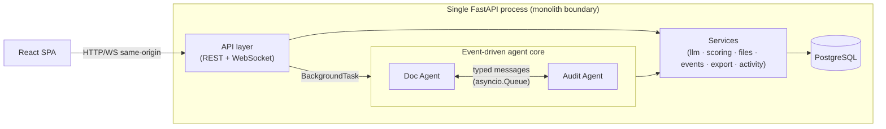

### Design principles enforced in code

- **Deterministic scoring, LLM-assisted facts.** The LLM extracts fields and writes prose; the
  *number* is pure Python math (`services/scoring.py`). "The AI cannot inflate its own grade."
- **Everything on the record.** Every agent action is persisted (`services/events.py::emit`);
  every human action is persisted (`services/activity.py`). Two independent audit trails.
- **Human-in-the-loop.** Agents never approve. The pipeline terminates in `IN_REVIEW`
  (`agents/orchestrator.py`); only a `reviewer`/`admin` can approve/reject (`api/reviews.py`).
- **Config over code.** Business processes and document types are database rows
  (`process_templates`, `doc_type_templates`), not classes. Adding a bank service = a seed row.
- **Provider-agnostic AI.** One wrapper, four back-ends (`services/llm.py`); the rest of the app
  never imports an SDK.

---

## 2. High-level system architecture

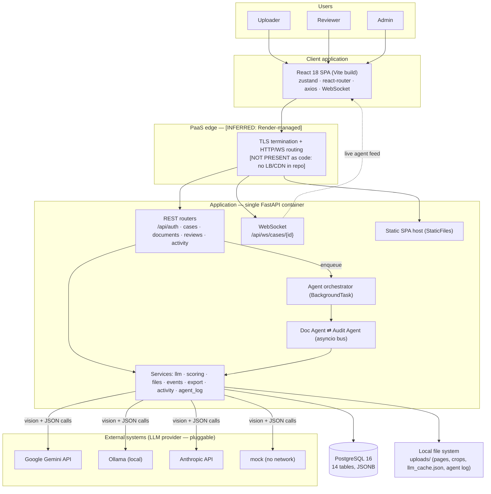

> **[NOT PRESENT]** There is no CDN, application load balancer, or reverse proxy defined in this
> repository. In a Render/Fly deployment the platform provides TLS + routing; that box is
> **[INFERRED]** from the deploy target, not from code.

---

## 3. C4 Model

### Level 1 — System Context

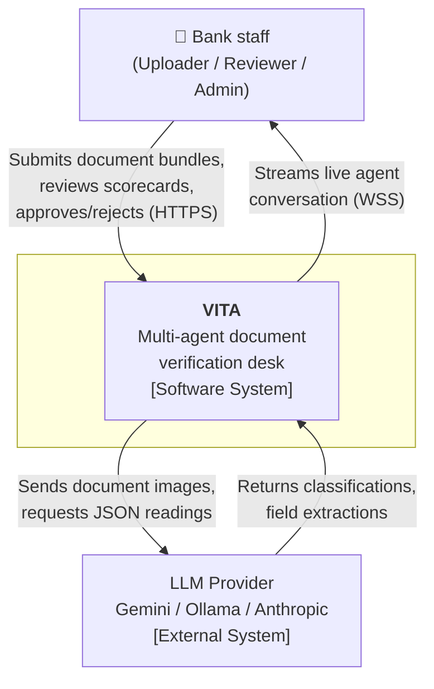

**Actors & externals**

- **Bank staff** — three roles (see [Security](../security/Security.md)).
- **LLM Provider** — one of four back-ends selected by `LLM_PROVIDER`. `mock` requires no
  external system at all (fully offline).

### Level 2 — Container Diagram

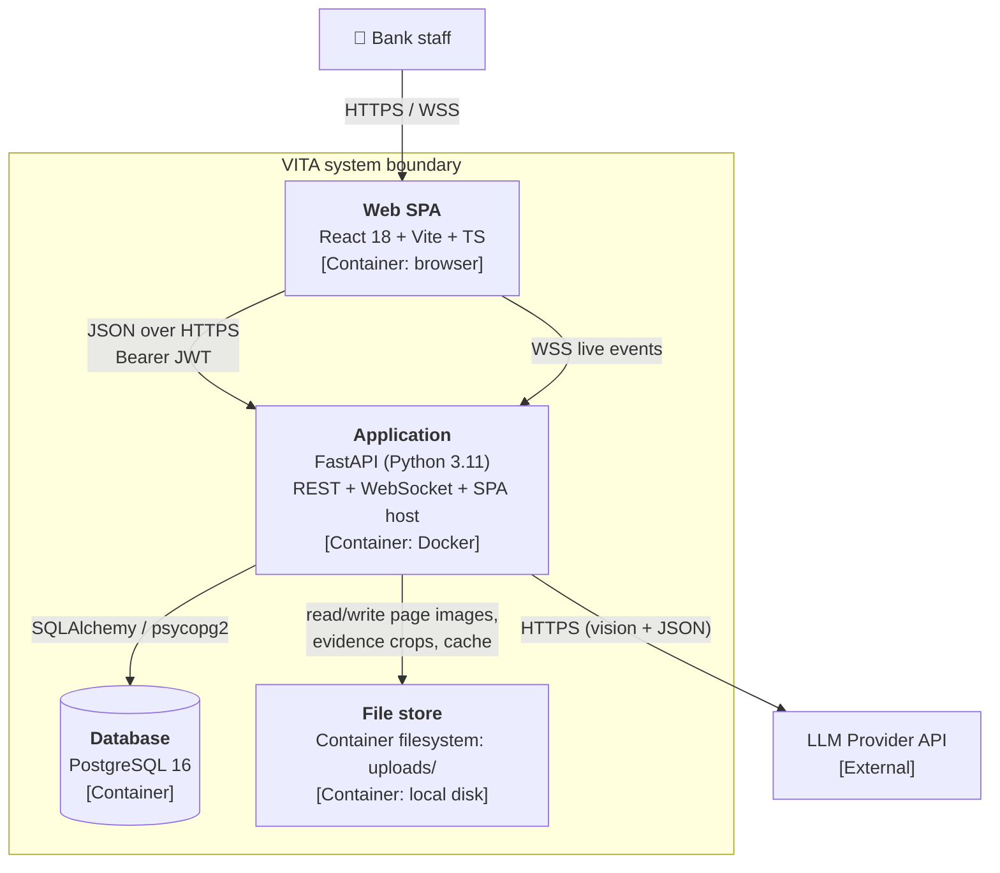

> **[ASSUMPTION]** In the single-service production image the SPA is not a separate deployed
> container — it is a static build served **by** the FastAPI container (`main.py` `StaticFiles`).
> It is drawn as its own container only to reflect that it executes in the browser.

### Level 3 — Component Diagram (Application container)

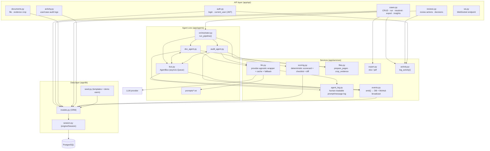

### Level 4 — Code Diagram (agent argument loop, where practical)

The most intricate logic is the challenge/defend/concede loop between agents. Rather than a
class diagram (agents are modules of async functions, not classes), the Level-4 view is the
control flow of a single disputed field:

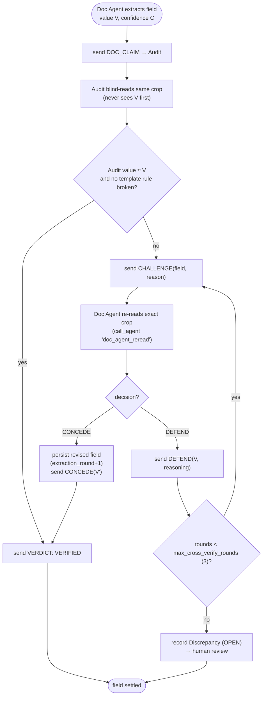

> Source: `agents/doc_agent.py::_handle`, `agents/audit_agent.py`, cap from
> `settings.max_cross_verify_rounds` (default 3).

---

## 4. Module dependency diagram

Dependencies point **downward only** (api → agents/services → db). No layer imports upward; no
service imports an API router. This acyclic direction is the key structural invariant.

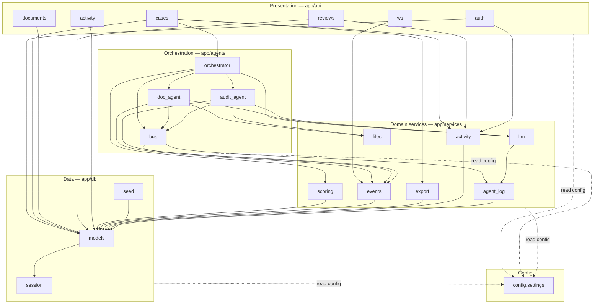

**Ownership** (**[INFERRED]** from a single-maintainer repo — adjust to your team's CODEOWNERS):

| Module group | Suggested owner |
|---|---|
| `app/api/*` | API / Platform team |
| `app/agents/*` | AI / Agents team |
| `app/services/llm.py` | AI / Agents team |
| `app/services/{scoring,export,files,activity,events}` | Core Backend team |
| `app/db/*` | Data / Backend team |
| `frontend/*` | Frontend team |

---

## 5. Package structure

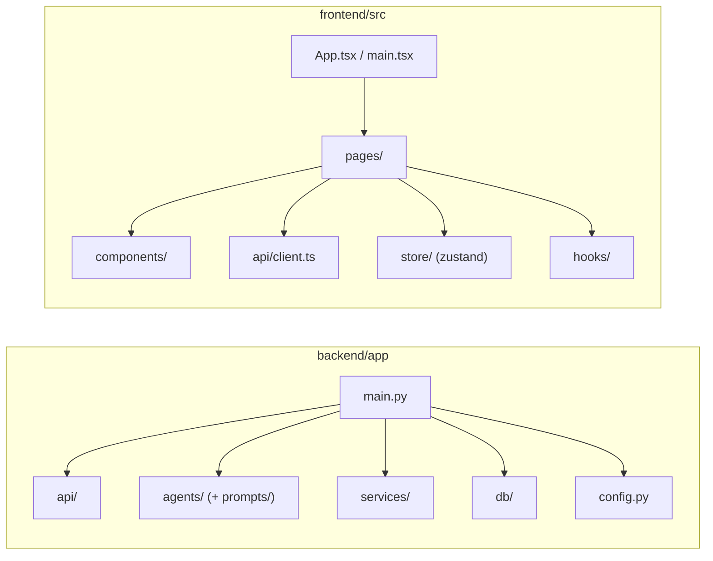

Physical layout (verified against the tree):

```
cleardesk/
├─ backend/app/
│  ├─ main.py                 FastAPI app, CORS, startup migrations, SPA host
│  ├─ config.py               pydantic-settings (env/.env)
│  ├─ api/                    auth, cases, documents, reviews, activity, ws
│  ├─ agents/                 orchestrator, bus, doc_agent, audit_agent, prompts/
│  ├─ services/               llm, scoring, files, events, export, activity, agent_log
│  └─ db/                     models, session, seed
├─ frontend/src/
│  ├─ pages/                  Login, Dashboard, NewCase, CaseDetail, ReviewQueue, ActivityLog, Insights
│  ├─ components/             Layout, AgentFeed, ScorecardPanel, PipelineStepper, DiscrepancyCard,
│  │                          DataTable, Clock, GlobePicker, SkylineScene, OfficeScene, ThemeToggle, …
│  ├─ store/                  auth, theme, timezone (zustand)
│  ├─ api/client.ts           axios instance + typed API + WS URL
│  └─ hooks/useCaseSocket.ts  history + live WebSocket feed
├─ sample_docs/               demo bundle generator
├─ Dockerfile · render.yaml · docker-compose.yml
└─ docs/                      this documentation set
```

---

## 6. Request-flow diagram

Generic path for an authenticated REST call, including the exception branches actually present
in the code (401 invalid token, 403 role guard, 404 not found, 409 conflict).

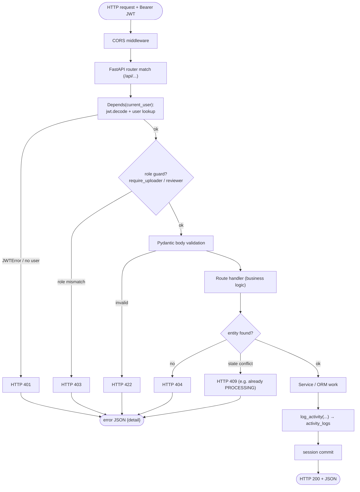

> Handlers that mutate state (`create_case`, `upload_files`, `run_case`, `resubmit_case`,
> `review_action`, exports) additionally call `log_activity(...)`. The heavy verification work
> is **not** done in the request thread — `run_case` enqueues `run_pipeline` as a FastAPI
> `BackgroundTask` and returns `202`-style `{status: PROCESSING}` immediately.

---

## 7. Data-flow diagram

End-to-end flow of a document from upload to human decision.

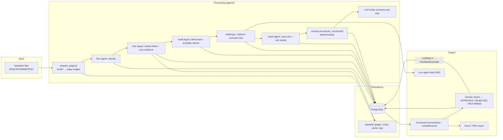

**Key data transformations**

1. **Files → page images** (`services/files.py::prepare_pages`) — PDFs/images normalised to
   per-page PNGs under `uploads/{case}/pages/`.
2. **Image → structured fields** — the LLM returns strict JSON; each field is persisted with a
   cropped evidence image (`crop_evidence`).
3. **Fields + discrepancies → number** — `scoring.py` averages field confidences and subtracts
   severity penalties (`INFO 0 / WARN 5 / FAIL 15`). Deterministic.
4. **Reviewer correction → training signal** — a `CORRECT` action writes a `FeedbackExample`
   later injected as few-shot context on the next extraction (`doc_agent.py`).

---

## 8. The agent subsystem (core innovation)

Two agents run under one `asyncio.gather`, each with an inbox queue on the `AgentBus`. The bus
does three things on every `send`: deliver to the recipient inbox, persist to `agent_events`
(audit), and broadcast over WebSocket (live UI). See
[sequence diagrams](../diagrams/sequence-diagrams.md) for the temporal view.

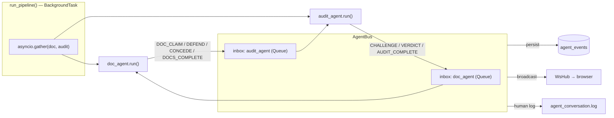

**Message protocol** (from `agents/bus.py` docstring — authoritative):

| Message | Direction | Meaning |
|---|---|---|
| `DOC_CLAIM` | doc → audit | "I read field X = V (conf C); evidence attached." |
| `DOCS_COMPLETE` | doc → audit | "Everything I was given is documented." |
| `CHALLENGE` | audit → doc | "I doubt claim K because R — re-read it." |
| `DEFEND` | doc → audit | "Re-read K: I confirm / revise to V'." |
| `CONCEDE` | doc → audit | "You're right, I misread K; revised to V'." |
| `VERDICT` | audit → doc | "Claim K is VERIFIED / DISPUTED (→ human)." |
| `AUDIT_COMPLETE` | audit → doc | "All claims settled; audit finished." |

**Termination.** The Doc Agent loops on its inbox until it receives `AUDIT_COMPLETE`; the
orchestrator's `gather` then returns, the scorecard is computed, and the case moves to
`IN_REVIEW`. Per-claim disputes are capped at `max_cross_verify_rounds` (default 3); unresolved
disputes become `Discrepancy` rows for a human.

---

## 9. Cross-cutting concerns

| Concern | Implementation | Location |
|---|---|---|
| **Configuration** | `pydantic-settings` from env/`.env` | `config.py` |
| **AuthN** | JWT HS256, bcrypt hashes | `api/auth.py` |
| **AuthZ** | role guards (`require_uploader`, reviewer check) | `api/cases.py`, `api/reviews.py` |
| **Async execution** | FastAPI `BackgroundTasks` + `asyncio.gather`; blocking LLM/IO wrapped in `asyncio.to_thread` | `orchestrator.py`, agents |
| **Messaging** | in-process `asyncio.Queue` bus **[NOT PRESENT: external broker]** | `agents/bus.py` |
| **Caching** | on-disk JSON LLM response cache | `services/llm.py` |
| **Rate limiting (egress)** | `_throttle()` spaces LLM calls (`llm_min_interval_s`) + model fallback chain | `services/llm.py` |
| **Logging** | agent prompt/message human log; audit trails in DB | `services/agent_log.py`, `events.py`, `activity.py` |
| **Exception handling** | per-file `try/except` so one bad upload never kills a case; pipeline errors reset status | agents, `orchestrator.py` |
| **Exports** | openpyxl (xlsx) + reportlab (pdf) | `services/export.py` |
| **Migrations** | `create_all` + `ALTER TABLE IF NOT EXISTS` at startup **[NOT PRESENT: Alembic]** | `main.py` startup |
| **Real-time** | WebSocket hub broadcasting `agent_events` | `services/events.py`, `api/ws.py` |
| **Timezone** | canonical IST storage; per-user display conversion | `db/models.py::now_ist`, frontend `store/timezone` |

See also: [DecisionLog.md](DecisionLog.md) for the reasoning behind these choices.
