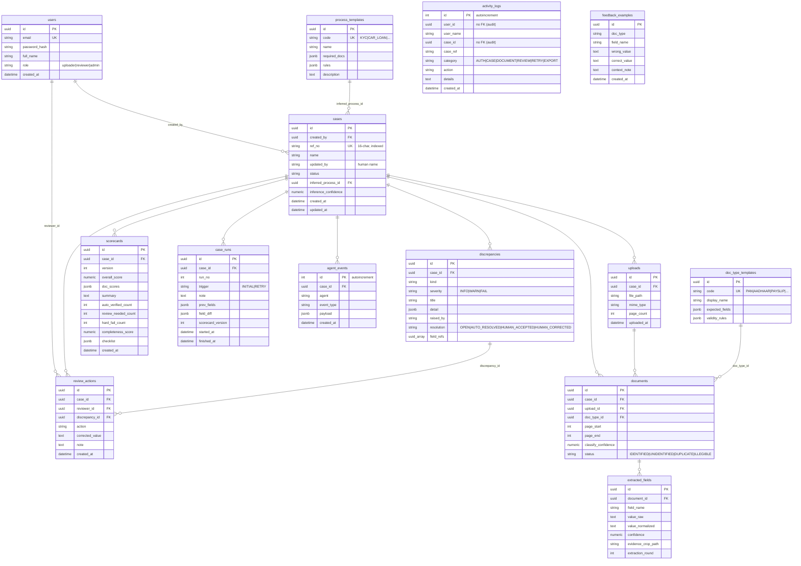
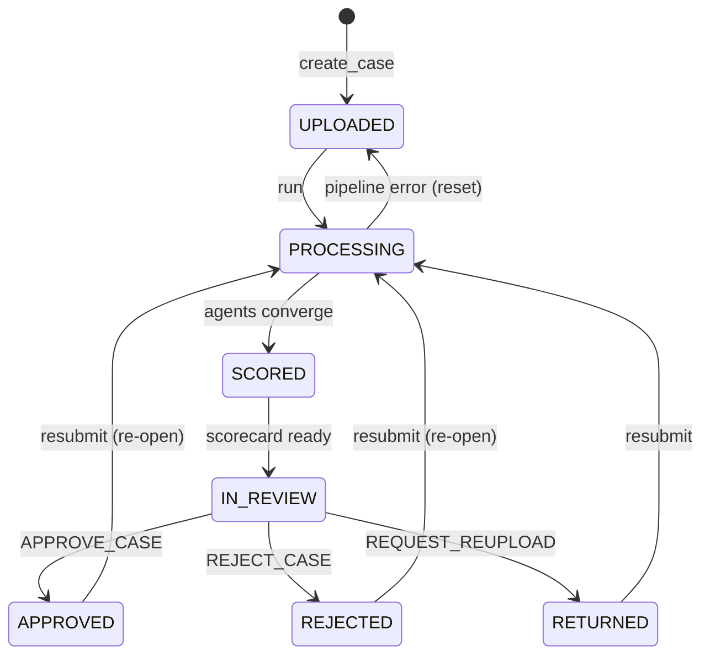

# Database

**Engine:** PostgreSQL 16. **Access:** SQLAlchemy ORM (`psycopg2-binary`), declarative models in
`backend/app/db/models.py`. **Schema management:** created at startup via
`Base.metadata.create_all` + idempotent `ALTER TABLE IF NOT EXISTS` mini-migrations in
`main.py` (**[NOT PRESENT: Alembic]** — see [ADR-009](../architecture/DecisionLog.md#adr-009)).

All timestamps are stored as **naive IST wall-clock** (`now_ist()`), converted to the viewer's
timezone in the frontend.

## Entity-Relationship Diagram



## Tables (14)

| Table | Purpose | PK | Key FKs |
|---|---|---|---|
| `users` | Accounts + role | `id` (uuid) | — |
| `process_templates` | Bank-service config (required docs, rules) | `id` | — |
| `doc_type_templates` | Document-type config (expected fields) | `id` | — |
| `cases` | One verification case | `id` | `created_by`→users, `inferred_process_id`→process_templates |
| `uploads` | Raw uploaded files | `id` | `case_id`→cases |
| `documents` | Classified logical documents | `id` | `case_id`, `upload_id`, `doc_type_id` |
| `extracted_fields` | Field readings + evidence + round | `id` | `document_id`→documents |
| `discrepancies` | Issues raised by agents | `id` | `case_id`→cases |
| `agent_events` | AI audit trail (streamed) | `id` (serial) | `case_id`→cases |
| `scorecards` | Versioned correctness+completeness | `id` | `case_id`→cases |
| `review_actions` | Human decisions | `id` | `case_id`, `reviewer_id`, `discrepancy_id` |
| `case_runs` | Per-run audit + field diff | `id` | `case_id`→cases |
| `activity_logs` | Human audit trail | `id` (serial) | loose ids (no FK) |
| `feedback_examples` | Reviewer corrections as few-shots | `id` | loose (no FK) |

## Indexes

**Defined explicitly in the model:**

- `cases.ref_no` — `unique=True, index=True` (case lookup by reference).
- Unique constraints (each backed by a unique index): `users.email`, `process_templates.code`,
  `doc_type_templates.code`, `cases.ref_no`.
- Primary keys are indexed by PostgreSQL automatically.

**[INFERRED / recommended, NOT PRESENT]** For production query patterns observed in the code
(filtering by `case_id`, ordering `agent_events`/`scorecards` by id/version, activity by
`user_id`/`case_id`), consider adding:

```sql
CREATE INDEX ix_documents_case_id        ON documents(case_id);
CREATE INDEX ix_extracted_fields_doc_id  ON extracted_fields(document_id);
CREATE INDEX ix_discrepancies_case_id    ON discrepancies(case_id);
CREATE INDEX ix_agent_events_case_id_id  ON agent_events(case_id, id);
CREATE INDEX ix_scorecards_case_version  ON scorecards(case_id, version DESC);
CREATE INDEX ix_activity_user_created    ON activity_logs(user_id, created_at DESC);
CREATE INDEX ix_activity_case_created    ON activity_logs(case_id, created_at DESC);
```

These are not in the codebase today; add them via a migration when data volume grows.

## JSONB payload shapes

Documented from producer/consumer code (`services/scoring.py`, `seed.py`, agents):

```jsonc
// process_templates.required_docs
[ { "doc_type": "PAN", "mandatory": true }, { "doc_type": "PAYSLIP", "mandatory": false } ]

// doc_type_templates.expected_fields
[ { "name": "pan_number", "regex": "[A-Z]{5}[0-9]{4}[A-Z]", "required": true } ]

// scorecards.doc_scores            → { "<document_id>": 98.0 }
// scorecards.checklist             → [ { "code","name","mandatory","present" } ]
// discrepancies.detail             → { "field":"name", "values":[ {"doc":"PAN","value":"..."} ] }
// case_runs.prev_fields            → { "PAN.name": "RITADHWAJ RAY", ... }
// case_runs.field_diff             → { "added":[], "updated":[{field,old,new}], "deleted":[] }
// agent_events.payload             → { "message": "...", "to": "audit_agent", ... }
```

## Case status lifecycle



> `SCORED` is a transient state inside `run_pipeline`; cases land in `IN_REVIEW` for humans.
> Values are strings (`Case.status`), not an enum type — the set is enumerated in the model
> comment.

## Seed data

`db/seed.py` (run on startup when `AUTO_SEED=true`, or `python -m app.db.seed`) upserts:

- **17 process templates** (Full/Partial KYC, savings account, personal/car/MSME/home loan,
  credit/debit card, cheque book, locker, FASTag, NACH/SI, passbook, dormant reactivation,
  mobile banking, tax filing), each with mandatory + optional document lists.
- **Document-type templates** with expected fields.
- **3 demo users** — `uploader@cleardesk.dev`, `reviewer@cleardesk.dev`, `admin@cleardesk.dev`
  (password `demo1234`, bcrypt-hashed).

Templates are re-applied (refreshed) on each seed; users are created only if absent.
