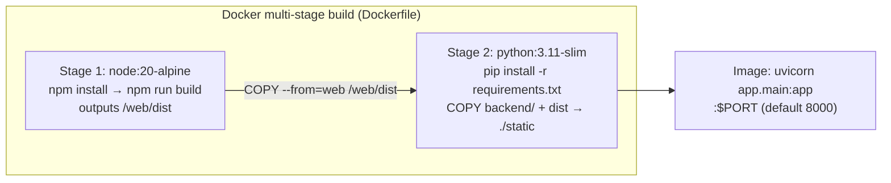
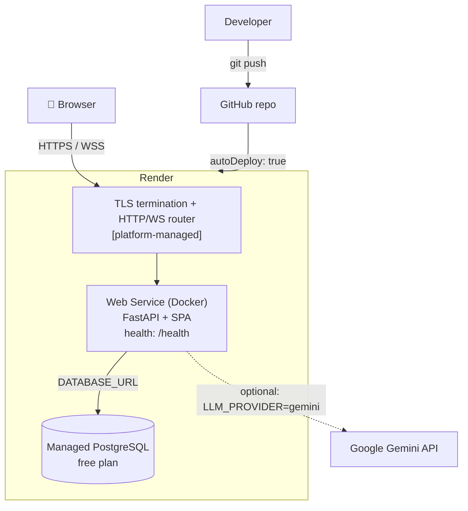
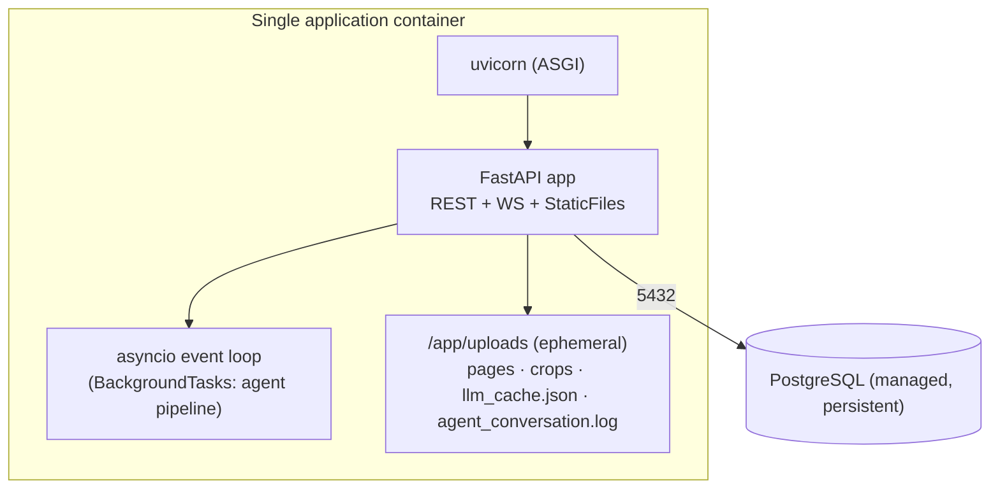

# Deployment Guide

VITA deploys as **one Docker image + one PostgreSQL database**. The image builds the React SPA
and serves it from the FastAPI backend on a **single origin** — no CORS, no cross-URL config.
Primary target is **Render** (free tier) via a blueprint; the same image runs on Railway/Fly.io.

For the narrative walkthrough see the root [`DEPLOY.md`](../../DEPLOY.md). This document is the
architecture-level view (topology, build stages, config, release process).

## 1. Build topology

The final container runs `uvicorn app.main:app --host 0.0.0.0 --port ${PORT:-8000}` with
`AUTO_SEED=true`, `LLM_PROVIDER=mock`, `UPLOAD_DIR=/app/uploads` baked as defaults.

## 2. Deployment diagram (Render)

> **[INFERRED]** The edge (TLS + routing) is provided by Render; it is **[NOT PRESENT]** as code.
> There is no CDN, no separate load balancer, no container orchestrator manifest.

## 3. Infrastructure diagram (runtime)

**Provisioned by `render.yaml`:** one `databases:` entry (`cleardesk-db`, free) and one
`services:` web entry (`cleardesk`, docker, free, health `/health`, `autoDeploy: true`) with env
vars `DATABASE_URL` (fromDatabase), `JWT_SECRET` (generated), `AUTO_SEED=true`, `LLM_PROVIDER=mock`.

## 4. Environments

| Env | DB | LLM | Notes |
|---|---|---|---|
| **Local dev** | `docker compose up -d` Postgres | `mock` (default) or `gemini` | Vite dev server proxies `/api` |
| **Local prod-like** | same | any | `docker build` + run the image, open `:8000` |
| **Cloud (Render)** | managed Postgres | `mock`, switch to `gemini` via env | single URL, WSS out of the box |

**[NOT PRESENT]:** distinct staging/prod pipeline definitions, blue-green/canary config. Render's
`autoDeploy` redeploys on push to the connected branch.

## 5. First-boot behaviour

On startup (`main.py`): create tables → run `ALTER TABLE IF NOT EXISTS` mini-migrations →
backfill missing `ref_no` → seed templates + demo users (if `AUTO_SEED`). This makes a fresh
database immediately usable; no manual migration step.

## 6. Release process

**[INFERRED from repo mechanics — there is no CI/CD file in-repo]:**

1. Develop on a feature branch; run the app locally (`mock` provider needs no key).
2. Regenerate sample docs if the generator changed: `python sample_docs/generate_samples.py`.
3. Merge to the deploy branch and `git push`.
4. Render detects the push (`autoDeploy: true`), rebuilds the Docker image (~4–8 min), injects
   env vars, and boots. The `/health` check gates traffic.
5. Verify: open the service URL, log in with a demo account, run a sample case.

Rollback: redeploy a previous commit from the Render dashboard (image is rebuilt from Git).

**Versioning:** the FastAPI app declares `version="0.1.0"` (`main.py`). There is no tag/release
automation; bump this string and tag in Git for a formal release.

## 7. Persistence & scaling caveats

- **Uploads are ephemeral** on free container disk — wiped on redeploy/restart. The schema stores
  file *paths*, so wiring S3/MinIO or a mounted disk is a localized change (`services/files.py`,
  upload handling). **[NOT PRESENT]** today.
- **Single instance** — the LLM response cache and the WebSocket hub are in-process. Running
  multiple replicas would fragment the cache and the live feed (a client connected to replica B
  won't see events emitted on replica A). For multi-replica, externalize the cache (Redis) and
  the pub/sub (broker) — a deliberate future step, not current design.
- **Free Postgres** on Render expires ~90 days; use Neon for a longer-lived free DB (see
  `DEPLOY.md`).

## 8. Deployment checklist

- [ ] `JWT_SECRET` set to a strong value (not the default).
- [ ] `DATABASE_URL` points at the managed DB.
- [ ] `LLM_PROVIDER` chosen; if `gemini`/`anthropic`, key set in the platform env store (never in Git).
- [ ] `AUTO_SEED` decision (leave `true` for demo; set `false` once real data exists).
- [ ] Health check green (`/health`).
- [ ] Confirm WSS live feed works (run a case, watch the agent feed).
