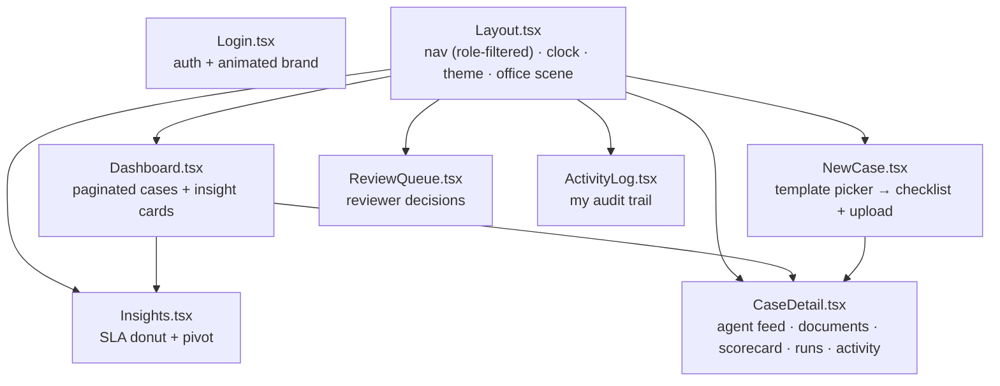

# Developer Guide

Everything a senior engineer needs to be productive on VITA: local setup, project structure,
component map, coding standards, contribution workflow, glossary, and FAQ.

## Contents

1. [Prerequisites](#1-prerequisites)
2. [Local development](#2-local-development)
3. [Project structure & component map](#3-project-structure--component-map)
4. [How a request becomes verified](#4-how-a-request-becomes-verified)
5. [Coding standards](#5-coding-standards)
6. [Contributing](#6-contributing)
7. [Testing](#7-testing)
8. [Glossary](#8-glossary)
9. [FAQ](#9-faq)

---

## 1. Prerequisites

| Tool | Version | For |
|---|---|---|
| Python | 3.11 | backend |
| Node.js | 20 | frontend build |
| Docker | any recent | local Postgres (and prod-like image) |
| (optional) Ollama | latest | fully-local LLM provider |

No LLM API key is required — the default `LLM_PROVIDER=mock` runs the entire pipeline offline.

---

## 2. Local development

Three terminals:

```bash
# Terminal 1 — database
docker compose up -d                                   # PostgreSQL 16 on :5432

# Terminal 2 — backend
cd backend
python -m venv .venv && .venv\Scripts\activate         # Windows (source .venv/bin/activate on *nix)
pip install -r requirements.txt
copy .env.example .env                                  # defaults use LLM_PROVIDER=mock (no key)
python -m app.db.seed                                   # templates + demo users (optional; startup also seeds)
uvicorn app.main:app --reload                           # http://localhost:8000/docs

# Terminal 3 — frontend
cd frontend
npm install
npm run dev                                             # http://localhost:5173 (proxies /api → :8000)
```

**Demo logins** (password `demo1234`): `uploader@cleardesk.dev`, `reviewer@cleardesk.dev`,
`admin@cleardesk.dev`.

**Sample documents:** `python sample_docs/generate_samples.py` generates test bundles for four
people with scenario variety (DOB mismatch, name variance, messy handwriting, clean path). Pick a
template in **New Case** and drop a person's matching folder.

**Enable real reading:** set `LLM_PROVIDER=gemini` + `GEMINI_API_KEY` in `backend/.env` (free key
at aistudio.google.com/apikey). Run `python scripts/check_gemini.py` to auto-detect a working
model.

---

## 3. Project structure & component map

See [Architecture §5](../architecture/Architecture.md#5-package-structure) for the package
diagram. Frontend pages and their responsibilities:



Supporting components: `AgentFeed` (live WS feed), `ScorecardPanel` (correctness+completeness
rings), `PipelineStepper`, `DiscrepancyCard`, `DataTable` (server-side paginate/sort/filter),
`GlobePicker` (3D timezone picker), `SkylineScene`/`OfficeScene` (theme-reactive animations),
`ThemeToggle`, `ErrorBoundary`. State in `store/` (auth, theme, timezone); API in
`api/client.ts`; live feed in `hooks/useCaseSocket.ts`.

---

## 4. How a request becomes verified

The mental model in one paragraph: A `POST /run` sets the case to `PROCESSING` and enqueues
`run_pipeline` as a background task. The orchestrator runs the Doc and Audit agents concurrently
over an in-process bus; the Doc Agent classifies and extracts each upload and publishes claims,
the Audit Agent blind-reads and challenges them, and they argue up to 3 rounds per field.
Unresolved disputes become discrepancies. When both agents finish, `scoring.py` computes a
deterministic score, the LLM writes a summary, and the case moves to `IN_REVIEW` for a human. See
the [sequence diagrams](../diagrams/sequence-diagrams.md) for the step-by-step.

---

## 5. Coding standards

Derived from the existing code — follow the patterns already in the repo:

**Backend (Python)**
- **Layering is one-directional:** `api` → `agents`/`services` → `db`. Never import an API router
  from a service; never import upward.
- **Type hints** on function signatures; `pydantic` models for request/response bodies.
- **Docstrings** on modules and non-trivial functions explaining *why*, not just *what* (see
  `scoring.py`, `bus.py`, `llm.py` for the house style).
- **Sessions:** use `Depends(get_db)` in request handlers; use `SessionLocal()` in background/
  agent code and always close in `finally`.
- **Async discipline:** wrap blocking calls (LLM HTTP, PIL, file IO) in `asyncio.to_thread` so the
  event loop stays free for the WebSocket feed.
- **Resilience:** wrap per-item work (one upload, one log write) in `try/except` so a single
  failure can't kill a case; use `# noqa: BLE001` only for these deliberate broad catches.
- **The LLM never scores.** Any grading/number logic goes in `scoring.py`, not a prompt.
- **Secrets** only from `settings`; provider keys go in headers, never URLs.

**Frontend (TypeScript/React)**
- Functional components + hooks; zustand for shared state.
- Route-level `React.lazy` for pages; keep bundles small.
- Typed API access through `api/client.ts` (single axios instance with the Bearer interceptor).
- Tailwind utility classes; theme via the `dark` class on `<html>` (single source of truth in
  `store/theme.ts`, applied at module load).
- Dedupe list keys by stable id (learned bug: duplicate `key` on same-named files broke removal).

**General**
- No secrets, keys, or PII in tracked files or logs.
- Prefer config rows (templates) over new code for new bank services / document types.

---

## 6. Contributing

**[INFERRED workflow]** (no `CONTRIBUTING`/CI in-repo yet — this is the recommended process):

1. Branch from the deploy branch: `feature/<short-name>`.
2. Make the change; keep the layering and standards above.
3. Run the app on `mock` and exercise the affected flow end-to-end (create → run → review).
4. If you touched the schema, add an idempotent `ALTER TABLE IF NOT EXISTS` in `main.py` startup
   (until Alembic is adopted — see [ADR-009](../architecture/DecisionLog.md#adr-009)).
5. If you touched the sample generator, regenerate: `python sample_docs/generate_samples.py`.
6. Update the relevant doc in `/docs` so documentation stays in sync with code.
7. Open a PR; on merge, Render auto-deploys.

**Commit style:** imperative, scoped subject (e.g. `Add completeness ring to ScorecardPanel`).

---

## 7. Testing

**[NOT PRESENT]:** there is no automated test suite in the repository today. Current verification
is manual + the `mock` provider (which makes the full pipeline deterministic and offline).

**Recommended test backlog** (add under `backend/tests/` and `frontend`):
- Unit: `scoring.recompute_scorecard` (penalty math, thresholds), `diff_fields`,
  `doc_agent._infer_process` (template scoring), `compute_checklist`.
- Integration: auth → create → upload → run (on `mock`) → scorecard → review, asserting status
  transitions and audit rows.
- Contract: OpenAPI snapshot at `/openapi.json`.
- Frontend: component tests for `DataTable` paging/sort and `useCaseSocket` dedupe.

The `mock` provider is the key enabler — it makes end-to-end tests hermetic (no network, canned
LLM responses in `services/llm.py::_MOCK_RESPONSES`).

---

## 8. Glossary

| Term | Meaning |
|---|---|
| **Case** | One verification job for a bundle of documents. |
| **Doc Agent** | The documenter: classifies, extracts fields, publishes claims, defends/concedes. |
| **Audit Agent** | The adversary: blind-reads, runs template checks, challenges, issues verdicts, sweeps for cross-doc issues. |
| **AgentBus** | In-process message bus (one `asyncio.Queue` inbox per agent). |
| **Claim / Challenge / Defend / Concede / Verdict** | The agent message protocol (see `bus.py`). |
| **Discrepancy** | An unresolved issue escalated to a human (`INFO`/`WARN`/`FAIL`). |
| **Scorecard** | Versioned, deterministic correctness score + completeness score + summary. |
| **Completeness score** | % of the template's *mandatory* documents present. |
| **Correctness / overall score** | Avg field confidence minus severity penalties. |
| **Process template** | A bank service config row (required docs + rules). |
| **Doc-type template** | A document config row (expected fields + validity rules). |
| **CaseRun** | Audit row for one pipeline run (initial or retry) with a field diff. |
| **FeedbackExample** | A reviewer correction recycled as few-shot context for future extraction. |
| **Extraction round** | Version of a field reading; re-reads increment it, latest wins. |
| **IST-canonical** | All timestamps stored as IST wall-clock; UI converts for display. |

---

## 9. FAQ

**Do I need an API key to run it?** No. `LLM_PROVIDER=mock` (default) runs the whole system —
parallel agents, disputes, scorecard, review — with no key and no network.

**Where does the score come from — the AI?** No. Agents produce facts (fields, confidences,
discrepancies); `services/scoring.py` computes the number in plain Python. The AI writes only the
summary text.

**Can the agents approve a case?** No, by design. The pipeline ends in `IN_REVIEW`; only a
`reviewer`/`admin` can approve/reject.

**How do I add a new bank service?** Add a `process_templates` row (and any new
`doc_type_templates`) in `db/seed.py`. No code change.

**Why two agents instead of one?** So verification is independent. The Audit Agent blind-reads the
same evidence before seeing the claimed value, so agreement is corroboration, not an echo.

**Is there a message broker / Redis / Kubernetes?** No — see the "not present" list in
[docs/README.md](../README.md). The bus is `asyncio`, the cache is a local file, deployment is one
container.

**Why did my uploaded files disappear?** On free container disk, uploads are ephemeral (wiped on
redeploy). Attach a disk or object storage for persistence.

**How do I see exactly what the agents said?** `GET /api/cases/{id}/events`, the live feed in
CaseDetail, or the `agent_conversation.log` / console when `LOG_AGENT_PROMPTS=true`.
