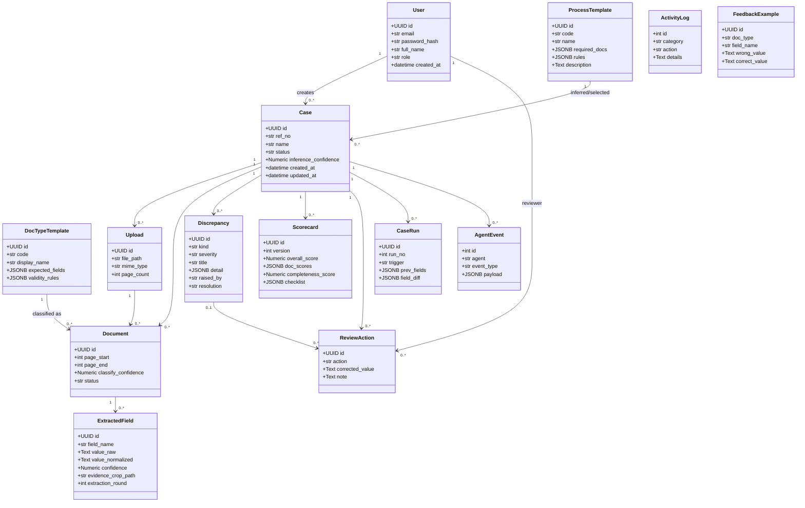
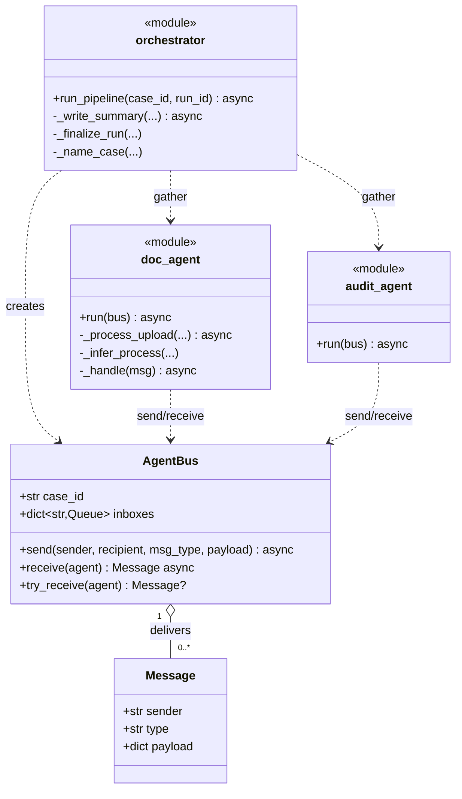
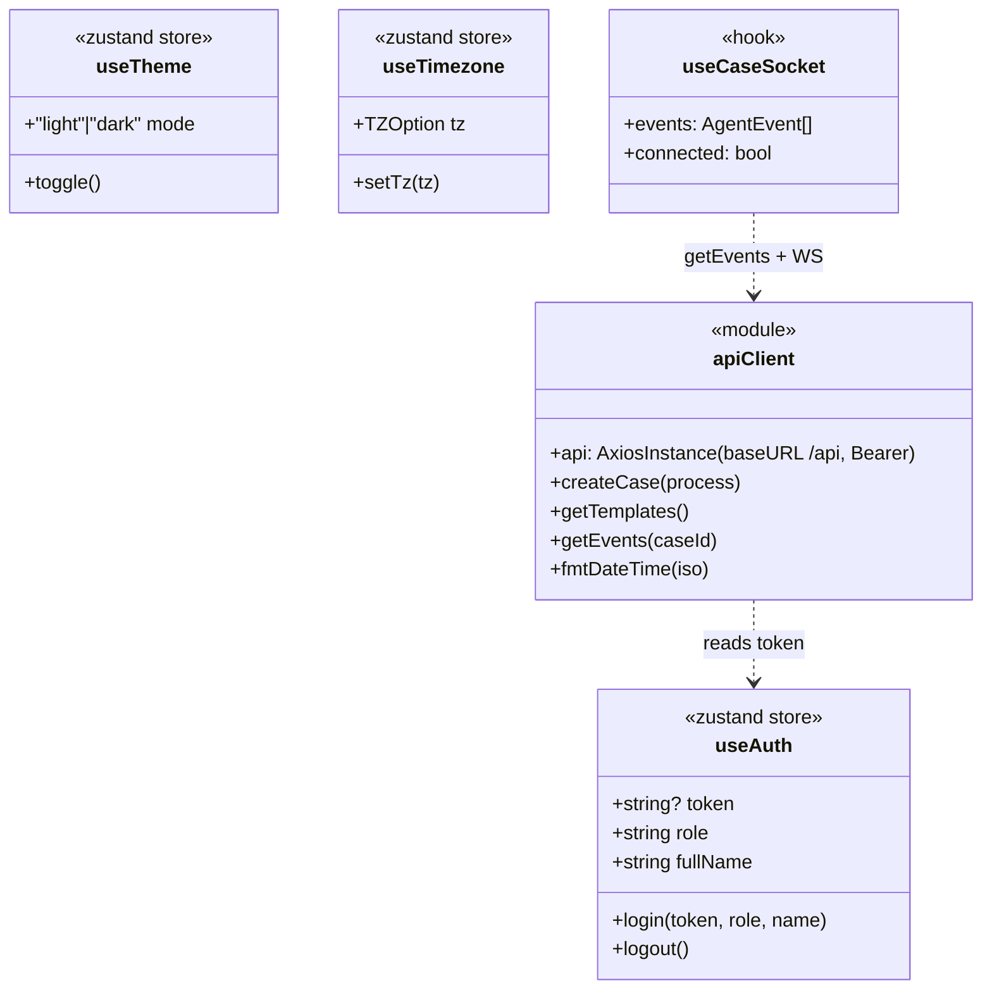

# Class & Type Relationship Diagrams

UML views of the important packages. Note: the backend uses SQLAlchemy ORM classes plus
**module-level async functions** (the agents and services are functional, not OO). Diagrams
reflect that reality rather than inventing class hierarchies.

## Contents

1. [ORM domain model](#1-orm-domain-model)
2. [Agent subsystem (functional + AgentBus)](#2-agent-subsystem)
3. [LLM provider layer](#3-llm-provider-layer)
4. [Frontend state & API types](#4-frontend-state--api-types)

---

## 1. ORM domain model

SQLAlchemy classes from `backend/app/db/models.py`. See [Database.md](../database/Database.md)
for full column detail; this view emphasises relationships and multiplicity.



> `ActivityLog` and `FeedbackExample` reference cases/users by loose id/name (no FK) by design —
> they are append-only audit/learning stores decoupled from cascade behaviour.

---

## 2. Agent subsystem

`AgentBus`/`Message` are dataclasses; agents are modules exposing an async `run(bus)`.



---

## 3. LLM provider layer

`services/llm.py` — one public entry (`call_agent`) dispatching to private provider functions.

```mermaid
classDiagram
    class llm {
        <<module>>
        +call_agent(agent_name, content, max_tokens) dict
        +load_prompt(name) str
        +image_block(path) dict
        -_mock(agent_name) dict
        -_gemini(...) str
        -_ollama(...) str
        -_anthropic(...) str
        -_throttle()
        -_cache_get(key) / _cache_put(key,val)
        -_discover_models(headers) list
    }
    class Settings {
        +str llm_provider
        +str gemini_model
        +str gemini_fallback_models
        +bool llm_cache
        +float llm_min_interval_s
    }
    llm ..> Settings : reads
    llm ..> "prompts/*.txt" : load_prompt
    note for llm "Quota savers: image downscale (image_block),\nJSON response cache, model fallback chain"
```

---

## 4. Frontend state & API types

zustand stores + the typed axios client (`frontend/src/store/*`, `api/client.ts`).


