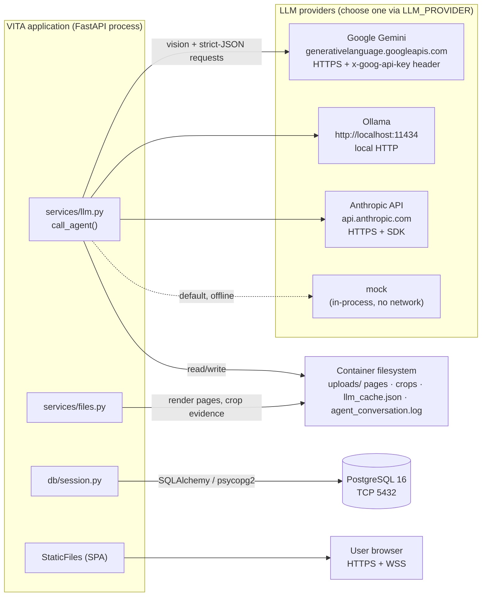

# External Integration Diagram

This diagram shows **every** integration point the code actually has with systems outside the
FastAPI process. It is deliberately short — VITA has a small external surface.

## Integration inventory

| Integration | Protocol | Direction | Auth | Code |
|---|---|---|---|---|
| **Google Gemini** | HTTPS REST (`/v1beta/models/{m}:generateContent`) | egress | API key in `x-goog-api-key` header | `services/llm.py::_gemini` |
| **Ollama** | HTTP (`/api/chat`) | egress (localhost) | none (local) | `services/llm.py::_ollama` |
| **Anthropic** | HTTPS via `anthropic` SDK | egress | API key | `services/llm.py::_anthropic` |
| **mock** | in-process | none | none | `services/llm.py::_mock` |
| **PostgreSQL** | TCP 5432, SQLAlchemy | egress | `DATABASE_URL` credentials | `db/session.py` |
| **File system** | local disk | read/write | n/a | `services/files.py`, `llm.py` cache/log |
| **Browser** | HTTPS + WebSocket | ingress | JWT bearer | `api/*`, `api/ws.py` |

## Notably absent integrations **[NOT PRESENT]**

No email/SMS gateway, no payment gateway, no message broker, no object storage (S3/MinIO), no
third-party KYC/identity API, no analytics/telemetry SaaS, no secrets manager. Document images
are read directly by the configured LLM; nothing is sent to any other third party.

> **Security note.** The Gemini key is passed in a request **header**, never in the URL, so it
> cannot leak via logged URLs or error messages (`services/llm.py`). See
> [Security.md](../security/Security.md).
