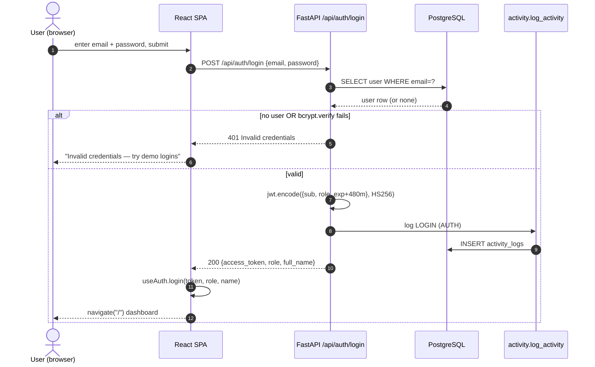
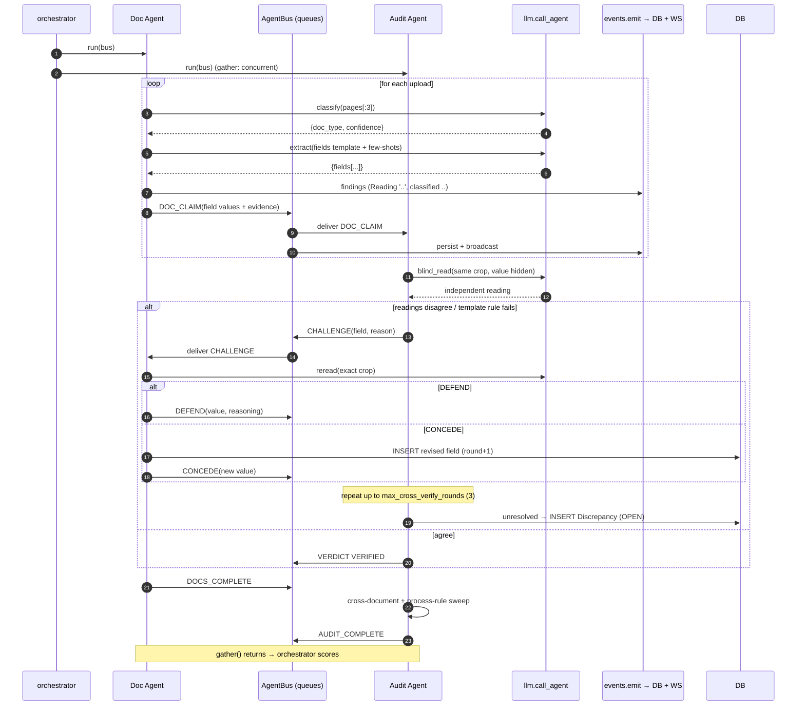
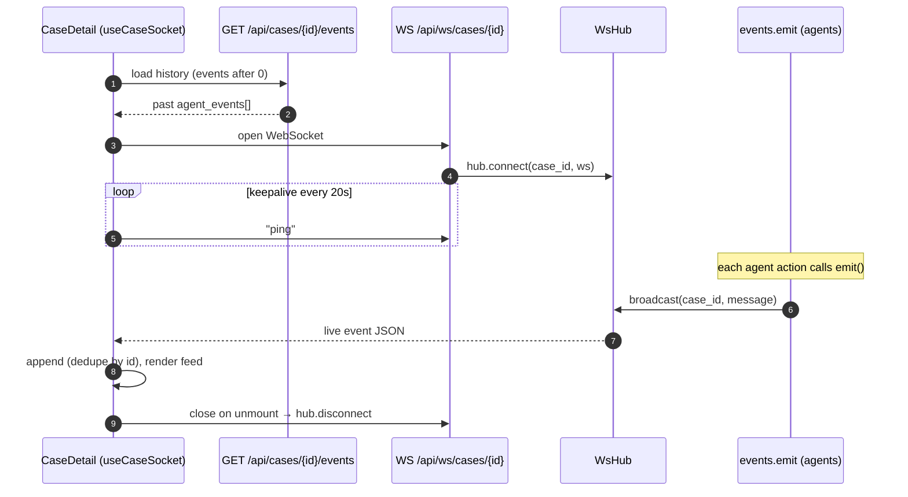
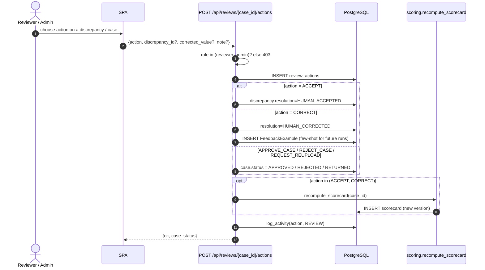
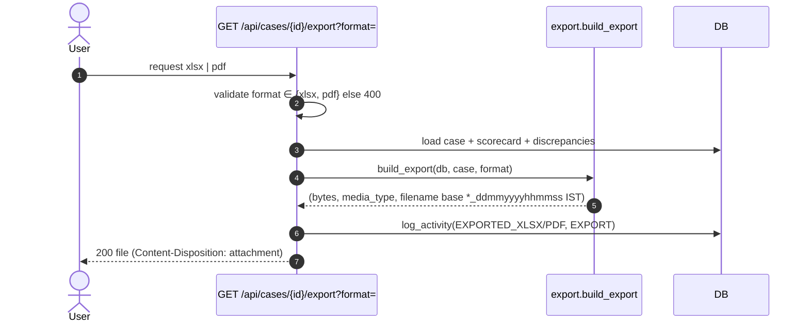

# Sequence Diagrams

Temporal views of the system's key flows. Every participant and message corresponds to real code
paths (file references given per diagram). Diagrams are Mermaid `sequenceDiagram`.

## Contents

1. [Login (authentication)](#1-login-authentication)
2. [Create case → upload → run pipeline (primary business workflow)](#2-create-case--upload--run-pipeline)
3. [Agent argument loop (challenge → defend/concede → verdict)](#3-agent-argument-loop)
4. [Live agent feed over WebSocket](#4-live-agent-feed-over-websocket)
5. [Human review & decision (CRUD-style mutation)](#5-human-review--decision)
6. [Edit-and-retry (resubmit) async workflow](#6-edit-and-retry-resubmit)
7. [Export scorecard (external-format generation)](#7-export-scorecard)
8. [Scheduled jobs](#8-scheduled-jobs)

---

## 1. Login (authentication)

Source: `frontend/src/pages/Login.tsx`, `backend/app/api/auth.py`.



---

## 2. Create case → upload → run pipeline

The primary business workflow. `run_case` returns immediately; verification runs in the
background. Source: `api/cases.py`, `agents/orchestrator.py`.

```mermaid
sequenceDiagram
    autonumber
    actor U as Uploader
    participant SPA
    participant API as /api/cases
    participant DB as PostgreSQL
    participant BG as BackgroundTasks
    participant ORCH as run_pipeline

    U->>SPA: pick template, create case
    SPA->>API: POST /api/cases {process}
    API->>API: require_uploader(user)
    API->>DB: INSERT case (status=UPLOADED, template locked)
    API-->>SPA: {id, status}

    U->>SPA: drag-drop files
    SPA->>API: POST /api/cases/{id}/uploads (multipart)
    API->>DB: save files + INSERT uploads
    API-->>SPA: {saved:[...]}

    U->>SPA: Run verification
    SPA->>API: POST /api/cases/{id}/run
    API->>DB: status=PROCESSING; INSERT case_runs(run_no=1, INITIAL)
    API->>BG: add_task(run_pipeline, case_id, run_id)
    API-->>SPA: 200 {status: PROCESSING}
    Note over SPA: SPA opens WebSocket (see diagram 4)

    BG->>ORCH: run_pipeline(case_id, run_id)
    Note over ORCH: asyncio.gather(doc_agent, audit_agent) — see diagram 3
    ORCH->>DB: recompute_scorecard() (deterministic)
    ORCH->>ORCH: LLM writes summary text only
    ORCH->>DB: finalize CaseRun (field diff), name case, status=IN_REVIEW
```

---

## 3. Agent argument loop

The heart of the system. Both agents run concurrently over `AgentBus`. Source:
`agents/orchestrator.py`, `agents/bus.py`, `agents/doc_agent.py`, `agents/audit_agent.py`.



---

## 4. Live agent feed over WebSocket

Source: `frontend/src/hooks/useCaseSocket.ts`, `api/ws.py`, `services/events.py`.



---

## 5. Human review & decision

Source: `api/reviews.py`. Corrections recompute the scorecard and feed back as training examples.



---

## 6. Edit-and-retry (resubmit)

Async re-run that snapshots fields, wipes prior analysis (keeping audit rows), and diffs.
Source: `api/cases.py::resubmit_case`, `orchestrator._finalize_run`.

```mermaid
sequenceDiagram
    autonumber
    actor U as Uploader
    participant API as POST /api/cases/{id}/resubmit
    participant DB
    participant BG as BackgroundTasks
    participant ORCH as run_pipeline

    U->>API: {note} (reason for retry)
    API->>API: require_uploader; reject if status=PROCESSING (409)
    API->>DB: snapshot fields_map() → prev_fields
    API->>DB: INSERT case_runs(run_no+1, RETRY, note, prev_fields)
    API->>DB: DELETE extracted_fields, documents, discrepancies (analysis only)
    Note over DB: scorecards + agent_events + review_actions KEPT as audit
    API->>DB: status=PROCESSING
    API->>BG: add_task(run_pipeline, case_id, run_id)
    API-->>U: {status: PROCESSING, run_no}
    BG->>ORCH: re-run agents
    ORCH->>DB: diff_fields(prev, new) → case_runs.field_diff (added/updated/deleted)
```

---

## 7. Export scorecard

Source: `api/cases.py::export_case`, `services/export.py`.



---

## 8. Scheduled jobs

**[NOT PRESENT].** The application defines **no** cron, scheduler, or batch job. Verification is
triggered only by an explicit `POST /run` or `/resubmit`. The single time-based behaviour is the
**SLA calculation** in `GET /api/cases/insights`, which is computed on-read (comparing
`created_at`/`updated_at` against a 24h window), not by a scheduled task.

> If recurring jobs are later required (e.g. nightly SLA-breach digests), they would be added as
> an external scheduler invoking an endpoint — no in-app scheduler exists today.
