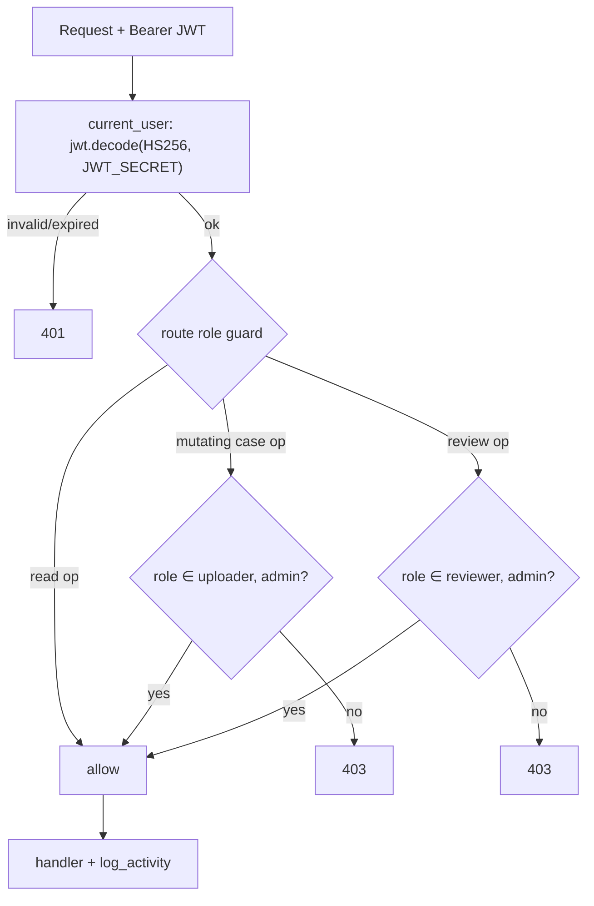
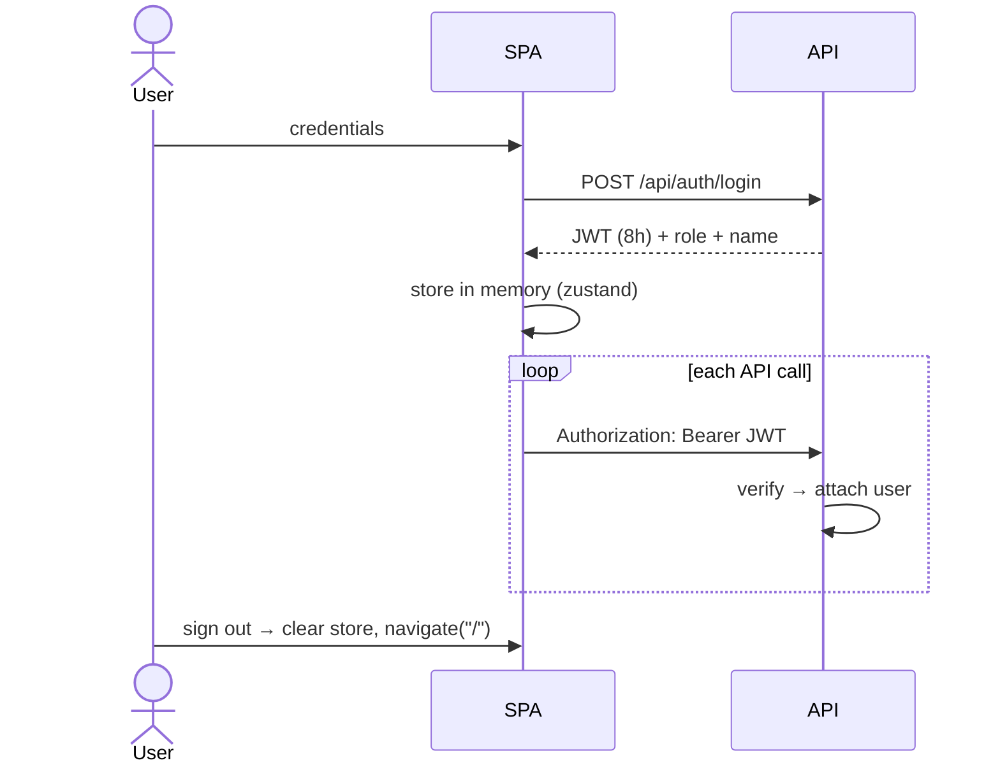

# Security Architecture

Scope: authentication, authorization, secrets, transport, and data handling **as implemented**.
This is a demo-grade system; hardening gaps are called out explicitly so they are not mistaken
for production guarantees.

## 1. Authentication (JWT)

- **Mechanism:** local email + password. Passwords are hashed with **bcrypt** (`passlib.hash.bcrypt`)
  and verified on login (`api/auth.py`).
- **Token:** on success the server issues a **JWT (HS256)** signed with `JWT_SECRET`, carrying
  `sub` (user id), `role`, and `exp` (now + `JWT_EXPIRY_MINUTES`, default **480 = 8h**).
- **Transport:** the SPA stores the token (zustand `useAuth`) and sends it as
  `Authorization: Bearer <jwt>` on every call (axios interceptor in `api/client.ts`).
- **Validation:** `current_user` dependency decodes and verifies the token on every protected
  route; a bad signature/expiry → `401`, unknown `sub` → `401`.

**[NOT PRESENT]:** refresh tokens, token revocation/denylist, MFA, OAuth/OIDC/SSO, password
reset, account lockout, rate-limiting on login.

## 2. Authorization (RBAC)

Three roles, enforced on **both** API and UI:

| Role | Can do | Enforced by |
|---|---|---|
| `uploader` | create / upload / run / retry / delete uploads / export | `require_uploader()` in `api/cases.py` |
| `reviewer` | review actions, approve / reject / return, export | role check in `api/reviews.py` |
| `admin` | **everything** (superuser — passes both guards) | included in both guards |

Read endpoints (dashboard, case detail, scorecard, events, activity) are available to any
authenticated user. The frontend additionally hides nav links per role (`components/Layout.tsx`),
but the **server guards are the source of truth** — hiding UI is convenience, not security.

## 3. Session & login flow

Tokens live in the in-memory store, not a cookie, so **CSRF is not applicable** and the wildcard
CORS policy (`allow_origins=["*"]`, `allow_credentials=False`) is safe (`main.py`). In the
same-origin production image CORS is never exercised.

## 4. Secrets management

| Secret | Source | Handling |
|---|---|---|
| `JWT_SECRET` | env var | Render generates a strong value (`generateValue: true`); default `change-me-in-prod` must be overridden in prod |
| `DATABASE_URL` | env var | injected from the managed DB (`fromDatabase`) |
| `GEMINI_API_KEY` / `ANTHROPIC_API_KEY` | env var (`.env`, gitignored) | passed to the provider; Gemini key sent in the **`x-goog-api-key` header, never the URL**, so it can't leak in logged URLs/errors (`services/llm.py`) |

**Policy (established in this repo):** secrets live only in `.env` (gitignored) or the platform's
env store — **never** in `.env.example` or any tracked file. **[NOT PRESENT]:** a dedicated
secrets manager (Vault, AWS Secrets Manager); env vars are the mechanism.

## 5. Transport & network

- Production is served over HTTPS/WSS by the PaaS (**[INFERRED]** from Render/Fly TLS).
- All application routes are under `/api`; the SPA is served same-origin.
- **[NOT PRESENT]:** WAF, IP allow-listing, mTLS, network policies.

## 6. Data handling & privacy

- Uploaded documents (which may contain PII: PAN, Aadhaar, payslips) are stored on the container
  filesystem under `uploads/{case_id}/` and read by the configured LLM provider. With
  `LLM_PROVIDER=mock` or `ollama`, **no data leaves the host**. With `gemini`/`anthropic`, images
  are sent to that provider — a data-processing consideration for any real deployment.
- Evidence crops and page renders are also on local disk. On Render's free tier this disk is
  **ephemeral** (wiped on redeploy) — see [OperationsGuide](../deployment/OperationsGuide.md).
- Two audit trails (`agent_events`, `activity_logs`) provide traceability of machine and human
  actions respectively.

## 7. Threat notes & hardening backlog

Honest gaps for a production review (all **[NOT PRESENT]** today):

1. **WebSocket authorization** — `WS /api/ws/cases/{id}` accepts any connection to a case id; it
   streams only agent conversation text, but a production build should authenticate the socket
   and authorize the case.
2. **Object-level authorization** — read endpoints do not check that the requesting user "owns"
   or is assigned the case; any authenticated user can read any case. Add per-case scoping for
   multi-tenant use.
3. **Login rate-limiting / lockout** — none; add before public exposure.
4. **File validation** — uploads are trusted by MIME/extension; add content sniffing, size caps,
   and AV scanning for untrusted sources.
5. **Migrations** — no Alembic; destructive schema changes are risky.
6. **Secret rotation** — no rotation workflow for JWT/provider keys.

These do not affect the demo's integrity guarantees (deterministic scoring, full audit trails,
human-in-the-loop) but must be addressed before handling real customer data.
